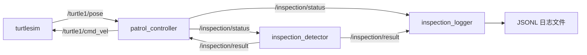

# ROS 2 巡检任务仿真

> **项目定位：AI 辅助的探索性学习实践。** 本项目通过小规模巡检任务仿真，在 AI 帮助下逐步学习 ROS 2 节点通信、任务状态机、参数配置和故障处理，并尝试建立自动化测试与人工集成验收相结合的验证流程。学习目标包括理解开发与仿真的思路，以及工程化测试中用例设计、异常场景、结果记录和验证边界的作用；同时练习按工程文档的形式说明实现、问题与测试依据。

本项目使用了 **AI 编程辅助工具**。仓库记录的是在 AI 辅助下推进实现、运行验证和逐步理解的学习实践；代码并非全部独立手写，项目完成也不意味着作者已独立掌握其中全部技术。**项目的功能、代码量、测试通过数量与文档完整度，不应直接视为作者独立开发、编程能力或成熟工程交付能力的证明。**

后文保留当前实现与实际运行记录，用于学习复盘和交流；文档写作属于工程表达练习，测试结果仅适用于已执行的用例和环境。项目功能与验证范围有限，不适用于生产环境或真实机器人部署。

基于 **ROS 2 Humble、Python 和 turtlesim** 的巡检流程演示。机器人依次前往巡检点，到点后请求模拟温度检测，统计异常点，并将状态和结果保存为 JSONL 文件。

默认路线为 **A(8,8) → B(2,8) → C(2,2)**。温度分别为 35、85、42℃，阈值为 80℃，最终异常点数为 1。温度异常会被记录，机器人继续执行后续巡检。

本项目用于学习 ROS 2 节点通信、状态机、参数配置、故障处理和测试。温度来自确定性模拟数据，移动使用基于当前位姿的目标点控制；不包含真实传感器、地图、避障或路径规划。

## 已验证环境

| 项目 | 环境 |
| --- | --- |
| 操作系统 | Ubuntu 22.04.5，VMware 虚拟机 |
| ROS 2 | Humble |
| Python | 3.10.12 |
| 包类型 | ament_python |
| 基础自动化测试 | Ubuntu 环境运行结果：58 passed in 0.40s |

运行与测试在上述 Ubuntu 环境中完成；下文列出的结果是该环境中的阶段性验证记录。

## 安装与启动

以下假定已安装 ROS 2 Humble，并已配置相应软件源；将本项目放在 `~/ros2_inspection_robot`，使包位于 `~/ros2_inspection_robot/src/inspection_robot`。

获取源码：

```bash
git clone https://github.com/iori-shino/ros2_inspection_robot.git ~/ros2_inspection_robot
```

安装构建、仿真和测试工具：

```bash
sudo apt update
sudo apt install ros-humble-turtlesim python3-colcon-common-extensions python3-pytest
```

构建工作空间：

```bash
source /opt/ros/humble/setup.bash
cd ~/ros2_inspection_robot
colcon build --symlink-install --packages-select inspection_robot
```

在同一终端加载工作空间并启动：

```bash
source ~/ros2_inspection_robot/install/setup.bash
ros2 launch inspection_robot inspection.launch.py
```

启动前停止之前手工运行的节点，避免多个 controller 同时发布速度指令。新终端需要重新加载 ROS 和工作空间环境。

launch 会启动日志节点、检测节点和 turtlesim，并延迟 2 秒启动控制节点。正常巡检完成后，节点保持运行，乌龟停止；在启动终端按 **Ctrl+C** 结束整组。关闭乌龟窗口也会触发其他节点退出。

默认加载安装目录中的 YAML。开发时可显式指定源目录配置：

```bash
ros2 launch inspection_robot inspection.launch.py params_file:=$HOME/ros2_inspection_robot/src/inspection_robot/config/inspection.yaml
```

修改源码中的配置后，使用上述源目录路径，或重新构建以更新安装目录中的文件。

## 一次巡检的运行结果

以下摘录自 Ubuntu 实际运行输出，省略了时间戳和进程前缀：

```text
Controller ready; points=3; max_linear_speed=1; movement_timeout=60 s.
[MOVING] Point A: (8.0, 8.0)
Point A inspected: temperature=35.0 C, abnormal=False
[MOVING] Point B: (2.0, 8.0)
Point B inspected: temperature=85.0 C, abnormal=True
[MOVING] Point C: (2.0, 2.0)
Point C inspected: temperature=42.0 C, abnormal=False
[COMPLETED] All 3 points inspected; abnormal points=1.
```

日志节点同时输出三个 `Saved result` 和一个 `Saved COMPLETED`。输出中的 `WARN` 表示 B 点温度异常，是默认演示预期的一部分。

## 节点与通信



| Topic | 类型 | 用途 |
| --- | --- | --- |
| `/turtle1/pose` | `turtlesim/msg/Pose` | 提供当前位置与朝向 |
| `/turtle1/cmd_vel` | `geometry_msgs/msg/Twist` | 下发线速度、角速度 |
| `/inspection/status` | `std_msgs/msg/String` | JSON 格式的任务状态和到点检测请求 |
| `/inspection/result` | `std_msgs/msg/String` | JSON 格式的温度检测结果 |

控制流程为 `WAITING → MOVING → INSPECTING`，每个点重复移动和检测，全部完成后进入 `COMPLETED`。位姿过期、移动超时或检测超时会进入 `ERROR`，持续发零速度；恢复运行需要重新启动控制节点。

控制周期为 0.1 秒。目标距离由平面坐标计算，方向误差归一化到 ±π 范围。角速度按方向误差计算并限幅，方向误差进入容差范围后才前进；线速度按距离计算并限幅。

每次启动 controller 生成新的 `run_id`，用于区分不同巡检任务。controller 只接收当前任务、当前巡检点的检测结果。

## 参数配置

配置文件：[inspection.yaml](src/inspection_robot/config/inspection.yaml)。参数在节点启动时读取，设为只读；修改后需要重启相应节点。

| 节点 | 参数 | 默认值或含义 |
| --- | --- | --- |
| controller | `point_ids`、`target_xs`、`target_ys` | A/B/C 及对应的 x、y 坐标，三个数组长度必须相同 |
| controller | `max_linear_speed`、`max_angular_speed` | 1.0、2.0 |
| controller | `linear_gain`、`angular_gain` | 0.8、2.0 |
| controller | `distance_tolerance`、`heading_tolerance` | 0.1、0.1 |
| controller | `pose_timeout_sec` | 已收到位姿后，超过 1 秒没有新位姿则报错 |
| controller | `movement_timeout_sec` | 单个目标移动超时：60 秒 |
| controller | `inspection_timeout_sec` | 等待检测结果超时：5 秒 |
| detector | `point_ids`、`temperatures_c` | A/B/C 对应 35.0、85.0、42.0℃ |
| detector | `temperature_threshold_c` | 80.0℃；严格大于阈值才异常 |
| logger | `output_dir` | `~/ros2_inspection_robot/logs` |

位移和线速度使用 turtlesim 坐标单位，不能直接当作真实机器人的米和米/秒。朝向、方向容差使用弧度，角速度使用弧度/秒。

controller 的速度、增益、容差和超时必须为有限正数，方向容差不超过 π；点名不能重复或为空。detector 的点名与温度数组长度必须匹配，温度和阈值必须为有限数。两个节点的配置应包含一致的巡检点名；当前没有跨节点配置一致性检查。

## 日志与消息

默认业务日志保存在 `~/ros2_inspection_robot/logs`。每次 logger 启动创建一个新文件，完整路径会显示在 `Logger ready; file=...` 中。ROS 自身的启动日志在 `~/.ros/log`，与业务记录分开。

JSONL 文件每行一条 JSON，结构示意如下：

```json
{"kind":"result","received_at":1.0,"data":{"run_id":"example-run","point_id":"B","timestamp":1.0,"temperature_c":85.0,"threshold_c":80.0,"is_abnormal":true}}
```

状态消息字段为 `run_id, point_id, timestamp, state, x, y, theta, detail`；结果消息字段为 `run_id, point_id, timestamp, temperature_c, threshold_c, is_abnormal`。`timestamp` 和 `received_at` 使用 Unix 秒，超时计时使用单调时钟。

发送和接收消息都经过字段校验，拒绝缺失或额外字段、无效类型、非有限数值以及与温度判断不一致的异常标记。

- detector 按 `(run_id, point_id)` 缓存首次结果，重复请求重发相同结果和时间戳。
- logger 对结果按 `(run_id, point_id)` 去重，对状态按 `(run_id, point_id, state)` 去重。
- 状态中的位姿和时间戳持续变化不会新增记录，因此此日志记录业务事件，不是完整运动轨迹。
- 每条记录写入后关闭文件；文件操作失败会报错并退出 logger。通过 launch 启动时，一个节点进程退出会触发整组关闭。

先启动 logger，再开始巡检。logger 不回放历史消息；中途启动可能缺少已发布的结果。主动关闭窗口中断的任务可能没有 `COMPLETED`，查看日志时应结合 `run_id` 和状态判断是否为完整任务。

## 测试与验收范围

以下测试与人工验收用于学习如何验证正常流程、边界输入与部分故障场景。58 项自动化测试主要针对核心逻辑，不能等同于 58 项完整 ROS 系统测试，也不代表完整测试覆盖或生产级可靠性。

在包源码根目录运行基础测试，无需启动 ROS 节点：

```bash
cd ~/ros2_inspection_robot/src/inspection_robot
python3 -m pytest tests/test_core.py -q
```

2026-09-26，Ubuntu 环境下的基础测试结果：

```text
58 passed in 0.40s
```

[test_core.py](src/inspection_robot/tests/test_core.py) 覆盖目标距离和转向、跨 ±π 边界、消息编解码、未知位姿、温度阈值，以及非法字段、布尔数值、NaN/Infinity、超大整数和错误 JSON。

以下是已完成的**手工集成验收**，不属于上述 58 项自动化测试：

| 场景 | 结果 |
| --- | --- |
| 默认 A → B → C 巡检 | 完成三点检测，异常数为 1 |
| 阈值覆盖为 90℃ | B 点 85℃被判为正常 |
| 自定义仅 B 点路线 | 完成一个点的巡检 |
| 数组长度不匹配、速度为 0 | 启动报配置错误，退出码 1 |
| 位姿丢失、没有 detector、移动超时 | controller 进入 ERROR 并停止移动 |
| 移动超时覆盖为 3 秒 | 实测约 3.10 秒触发，控制周期为 0.1 秒 |
| 重复请求与非法消息 | 业务文件指纹未改变，非法消息被警告并忽略 |
| 日志目录无法创建 | logger 明确报错，退出码 1 |
| 参数文件路径不存在 | launch 在启动节点前拒绝，退出码 1 |
| Ctrl+C 或关闭乌龟窗口 | 整组节点结束 |

新环境安装流程未在全新虚拟机上重新验收；上面的测试结果来自已有 Ubuntu 开发环境。

## 源码结构

| 文件 | 功能 |
| --- | --- |
| [patrol_logic.py](src/inspection_robot/inspection_robot/patrol_logic.py) | 距离、方向误差计算 |
| [message_utils.py](src/inspection_robot/inspection_robot/message_utils.py) | 消息格式与有效性检查 |
| [patrol_controller.py](src/inspection_robot/inspection_robot/patrol_controller.py) | 状态机、速度控制、超时与任务匹配 |
| [inspection_detector.py](src/inspection_robot/inspection_robot/inspection_detector.py) | 温度判定和结果缓存 |
| [inspection_logger.py](src/inspection_robot/inspection_robot/inspection_logger.py) | 文件记录与去重 |
| [inspection.launch.py](src/inspection_robot/launch/inspection.launch.py) | 统一启动、参数路径与退出联动 |

## 当前边界

这是小规模巡检流程仿真，没有真实机器人导航、传感器采集、避障、SLAM 或故障恢复功能。坐标只检查有限性，超出仿真可达范围的目标可能触发移动超时。

启动延迟 2 秒只是给其他进程留出时间，不是节点就绪握手；首次等待位姿也没有超时。特别慢的启动环境可能漏掉早期状态。

缓存和去重集合保存在内存中，随任务积累增长；不提供跨重启去重、断点恢复、掉电持久性或端到端 exactly-once 保证。不同 topic 的记录按接收顺序写入，不保证跨 topic 的因果顺序。

`COMPLETED` 和 `ERROR` 是业务状态，不代表进程退出。节点仍保持运行，直到用户结束程序；没有自动重试。

## 许可证

采用 [MIT License](LICENSE)。
